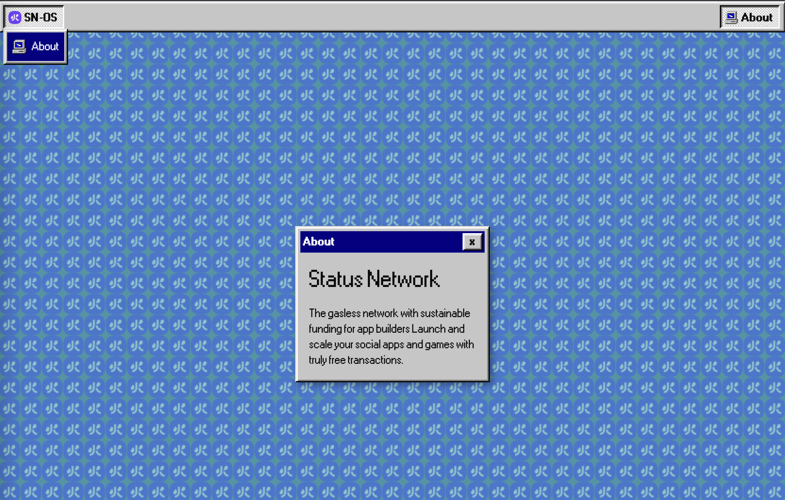

# Status Network OS

Old computer style gateway to Status Network ecosystem



## Installing

1. Install dependencies
   ```bash
   pnpm install
   ```

2. Fire up the server and watch files

   ```bash
   pnpm dev
   ```

<br/>


## CI/CD

- [CI builds](https://ci.infra.status.im/job/website/job/os.status.network/) `master` and pushes to `deploy-master` branch, which is hosted at <https://os.status.network/>.
- [CI builds](https://ci.infra.status.im/job/website/job/dev-os.status.network/) `develop` and pushes to `deploy-develop` branch, which is hosted at <https://dev-os.status.network/>.

The hosting is done using [Caddy server with Git plugin for handling GitHub webhooks](https://github.com/status-im/infra-misc/blob/master/ansible/roles/caddy-git).

Information about deployed build can be also found in `/build.json` available on the website.

### Made with ❤

by [status.network](https://status.network/) team
